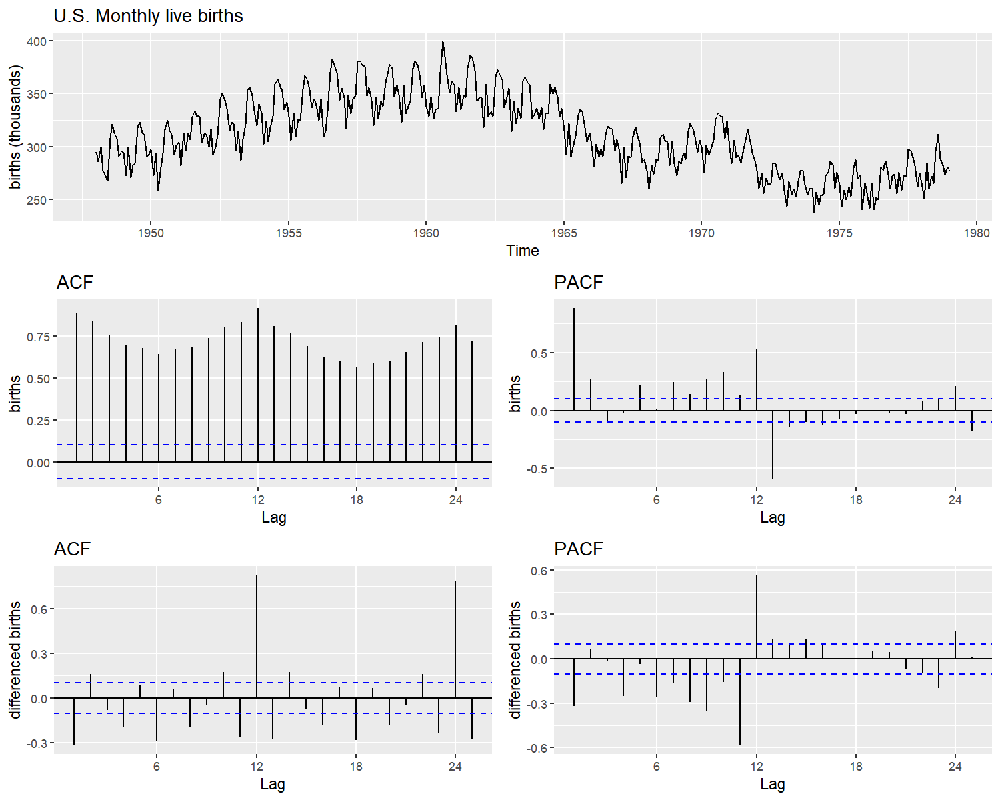
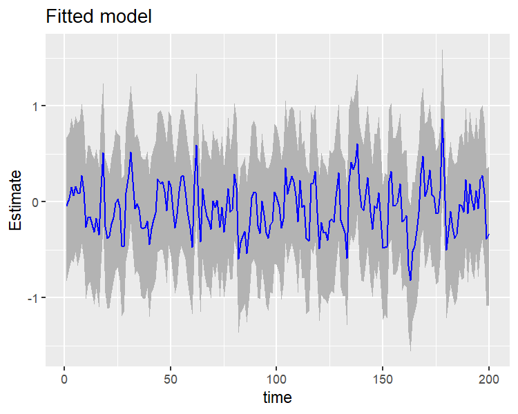
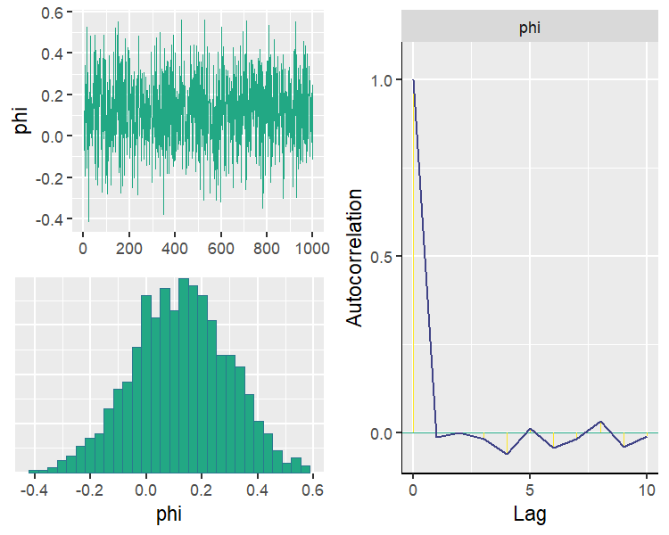

[](http://mc-stan.org)

**varstan**
===========

Varstan is a a package for bayesian estimation of structured time series
models,using the Hamiltonian monte carlo method, implemented with
[Stan](http://mc-stan.org/), a probabilistic language model in C++. The
aim of varstan is to have an interface of the most popular time series
modeles such as: sarima,garch, stochastic Volatility models (*SVM*),
Hiden Markov models(*HMM*), Dynamic Harmonic regresion, additive
non-linear models (*via*
[prophet](https://github.com/facebook/prophet)), univariate kalman
Filters, varma and bekk models.

On the beta version 0.5.0.000, the avaliable models are:

-   arima
-   Seasonal arima
-   garch
-   varma
-   Bekk
-   Dynamic regression +Dynamic Harmonic regresion

The dynamic of varstan is to build your own model using one of the
avaliable model constructor, personalize your own priors (*check the Use
Priors vignette*), and fit your model using the varstan function. On the
next example we show you how to create and fit a simple bayesian arima
model.

### Installing varstan

Varstan is stil a beta version package, so currently installing it could
be challenging, we recomend to first install the package rstan, you can
follow the instalation procedure
[here](https://github.com/stan-dev/rstan/wiki/RStan-Getting-Started)

### Troubleshooting Rstan / Rtools install for Windows:

Ensure recent version of R and Rtools is installed.

try including these lines in home/.R/makevars. :

    CXX14 = g++ -std=c++1y
    CXX14FLAGS = -O3 -Wno-unused-variable -Wno-unused-function

If makevars does not exist, run this code within R:

``` r
dotR <- file.path(Sys.getenv("HOME"), ".R")
if (!file.exists(dotR)) dir.create(dotR)
M <- file.path(dotR, ifelse(.Platform$OS.type == "windows", "Makevars.win", "Makevars"))
if (!file.exists(M)) file.create(M)
cat("\nCXX14FLAGS=-O3 -march=native -mtune=native",
    if( grepl("^darwin", R.version$os)) "CXX14FLAGS += -arch x86_64 -ftemplate-depth-256" else
      if (.Platform$OS.type == "windows") "CXX11FLAGS=-O3 -march=native -mtune=native" else
        "CXX14FLAGS += -fPIC","CXX11FLAGS=-O3 -mtune=native CXX14 = $(BINPREF)g++ -m$(WIN) -std=c++1y",
    "CXX14 = g++ -std=c++1y","CXX14FLAGS = -O3 -Wno-unused-variable -Wno-unused-function",
    file = M, sep = "\n", append = TRUE)
```

### Install varstan from git

For installing varstan package for git use the code on the next chunk:

``` r
install.packages(c("rstan","bridgesampling","loo","Rcpp","rstantools","devtools"))
library(devtools)
Sys.setenv(PATH = paste("C:/Rtools/bin", Sys.getenv("PATH"), sep=";"))
Sys.setenv(PATH = paste("C:\\Rtools\\mingw_64\\bin", Sys.getenv("PATH"), sep=";"))
Sys.setenv(BINPREF = "C:/Rtools/mingw_$(WIN)/bin/")
install_github("asael697/varstan",dependencies = TRUE)
```

### Current models

The package offers an S3 object for the basic models implemented, for
simplicity you can use the function to see the list of all the models
implemented in the actual package version:

``` r
version(View = FALSE)
#> package: varstan 
#> version: 1.0.0.000 
#> Algorithm: Stan-NUTS 
#> Current classes: varstan, Sarima, garch, varma, Bekk,DWR 
#> Current models: 
#>        model                         functions                                GenT
#> 1 Seasonal- ARIMA             Sarima(order = c(p,d,q), seasonal = c(P,D,Q) )  FALSE
#> 2 Dynamic-Regression          Sarima(order = c(p,d,q), xreg != NULL )         FALSE
#> 3 arma-mgarch                 garch(order=c(s,k,h),arma = c(p,q) )            TRUE
#> 4 varma-mbekk                 varma(order=c(p,q),bekk = c(s,k,h) )            TRUE
#> 5 Bekk                        Bekk(order=c(s,k,h),varma = c(p,q) )            TRUE
#> 6 Dynamic-Harmonic-Regression Sarima(order = c(p,d,q), xreg= fourier(ts,K) )  FALSE
#> 7 Random-walk                 naive(seasonal = FALSE)                         FALSE
#>  * model column represent the available model 
#>  * functions column represent the function structure 
#>  * GenT column represent if the model admits a generalized t-student distribution 
#>  * Report a bug in asael_am@hotmail.com 
#> 
```

### Case study: Analyzing the monthly live birth in U.S. an example

As an example, we provide a time series modeling for the monthly live
births in the United States 1948-1979, published by *Stoffer2019*. In
*figure 1* , the data has a seasonal behavior that repeats every year.
The series *waves* in the whole 40 years period (*superior part*). In
addition, the partial (*pacf*) and auto-correlation (*acf*) functions
are far from zero (*middle part*), and have the same wave pastern as
birth series. Indicating non stationary and a strong cyclical behavior.
After applying a difference to the data, the acf and pacf plots still
have some non-zero values every 12 lags (*inferior part*).

``` r
dbirth = diff(birth)

g1 = autoplot(birth)+labs(y= "births (thousands)",title ="U.S. Monthly live births")
g2 = ggAcf(birth)+labs(y ="births",title = "ACF")
g3 = ggPacf(birth)+labs(y ="births",title = "PACF")
g4 = ggAcf(dbirth)+labs(y ="differenced births",title = "ACF")
g5 = ggPacf(dbirth)+labs(y ="differenced births",title = "PACF")


grid.arrange(g1,g2,g3,g4,g5,layout_matrix = lay1)
```


<p class="caption">
Monthly live birth U.S.A
</p>

``` r
rm(g1,g2,g3,g4,g5,dbirth)
```

For start, a seasonal ARIMA model could give a good fit to the data,
following *Tsay2010* recommendations for order selection using the
auto-correlation functions, we define p = 1, d = 1, q = 1 and for the
seasonal part P=1, D = 1 and Q = 1. The model is defined in *varstan* as
follows

``` r
model1 = Sarima(birth,order = c(1,1,1),seasonal = c(1,1,1))
model1
#> 
#> y ~ Sarima(1,1,1)(1,1,1)[12] 
#> 373 observations and 1 dimension 
#> Differences: 1 seasonal Differences: 1 
#> Current observations: 360 
#>  
#> Priors: 
#>  Intercept:
#> mu0 ~ t (loc = 0 ,scl = 2.5 ,df = 6 )
#> 
#>  Scale Parameter: 
#> sigma0 ~ half_t (loc = 0 ,scl = 1 ,df = 7 )
#> 
#> ar[ 1 ] ~ normal (mu =  0 , sd =  0.5 ) 
#> ma[ 1 ] ~ normal (mu =  0 , sd =  0.5 ) 
#> 
#>  Seasonal Parameters: 
#> sar[ 1 ] ~ normal (mu =  0 , sd =  0.5 ) 
#> sma[ 1 ] ~ normal (mu =  0 , sd =  0.5 ) 
#> NULL
```

The function *Sarima()* generates a Seasonal ARIMA model ready to be
fitted in *Stan*. As the model is printed, all the important information
is shown: the model to be fit, the total observations of the data, the
seasonal period, the current observations that can be used after
differences, and a list of priors for all the model parameters. Using
the information provided by the *acf plot* in figure 1 (*middle right*),
the partial auto-correlations are not that strong, and a normal
distribution for the auto-regressive coefficient (*ar\[1\]*) could
explore values close to 1 or -1, causing the prior to be too
informative. Instead beta distribution in \[ − 1, 1\] (*If
*θ* ∼ *b**e**t**a*(*α*, *β*) in \[0, 1\] then
*θ*<sub>1</sub> = 2(*θ* − 1) ∼ *b**e**t**a*(*α*, *β*) in \[ − 1, 1\]*)
centered at zero, could be a more proper prior. With the functions
*set\_prior()* and *get\_prior()* we automatically update and check our
changes.

``` r
model1 = set_prior(dat = model1,type = "ar",par1 = 2,par2 = 2,dist = "beta")
get_prior(dat = model1,type = "ar")
#> ar[ 1 ] ~ beta (form1 =  2 , form2 =  2 )
```

Now that the model and priors are defined, what follows is to fit the
model using the *varstan()* function. We simulate 1 chain, of 2,000
iterations and warm-up of the first 1,000 chain’s values.

``` r
sfit1 = varstan(model1,chains = 1)
```

All fitted models are *varstan* objects, these are S3 classes with the
*stanfit* results provided by the *rstan* package, and other useful
elements that make the modeling process easier. After fitting our model
we can make a visual diagnostic of our parameters, check residuals and
fitted values using the plot method. On *figure 2* trace and posterior
density plots are illustrated for all the model parameters.

``` r
plot(sfit1,type = "parameter")
```



to have multi-modal distributions, indicating that all chains have mixed
and converged. One useful way to assess models fit, is by the residuals
(*e*<sub>*t*</sub> = *Y*<sub>*t*</sub> − *Ŷ*<sub>*t*</sub>). The package
provides the posterior sample of every residual, but checking all of
them is an exhausting task. An alternative, is checking the process
generated by the residuals posterior estimate. A white noise behavior
indicates a good model fit. The model’s residuals in figure 3, seems to
follow a random noise, the auto-correlation in *acf plots* quickly falls
to zero, indicating an acceptable model fit.

``` r
p1 = plot(sfit1,type = "residuals")
p2 = plot(sfit1)

grid.arrange(p2,p1,ncol = 1)
```



Because of the sinusoidal pattern that birth series (*figure 1*)
presents, a dynamic Harmonic regression (*A fourier transform with arima
structure for errors*) could also assess a good fit *harima*. To declare
this model, varstan offers a similar declaration structure of *Rob2007*
**forecast** package. A harmonic regression with 4 fourier terms and
ARIMA(1,1,1) residuals is declared and fitted to the birth data.

``` r
model2 = Sarima(birth,order = c(1,1,1),xreg = fourier(birth,K = 2))
sfit2 = varstan(model = model2,chains = 1,iter = 2000,warmup = 1000)
```

``` r
sfit2
#> 
#> y ~ Sarima(1,1,1).reg[4] 
#> 373 observations and 1 dimension 
#> Differences: 1 seasonal Differences: 0 
#> Current observations: 372 
#>  
#>              mean     se       2.5%      97.5%       ess   Rhat
#> mu0       -0.0773 0.0065    -0.0900    -0.0646 1069.5412 1.0001
#> sigma0    10.7657 0.0128    10.7406    10.7908  958.0279 1.0005
#> phi       -0.2627 0.0019    -0.2664    -0.2590  902.3653 1.0006
#> theta      0.6321 0.0015     0.6291     0.6350  863.2731 1.0001
#> breg.1   -21.4846 0.0406   -21.5641   -21.4050  947.3377 1.0004
#> breg.2     0.5771 0.0275     0.5232     0.6310 1043.4497 1.0012
#> breg.3     4.7873 0.0211     4.7460     4.8286 1027.7898 0.9992
#> breg.4    -5.2443 0.0251    -5.2935    -5.1951 1143.4878 0.9997
#> loglik -1415.3885 0.0669 -1415.5197 -1415.2573 1009.5068 0.9993
#> 
#>  Samples were drawn using sampling(NUTS). For each parameter, ess
#>  is the effective sample size, and Rhat is the potential
#>  scale reduction factor on split chains (at convergence, Rhat = 1).
```

In this scenario both models seem to be a good choice for birth series
analysis. Even so the harmonic regression fits more parameters. It is an
obvious choice for birth’s sinusoidal behavior. As an example of model
selection criteria, we compute the *bayes\_factor()* in logarithmic
scale, that compares the marginals models likelihoods, values above 6
(*in logarithmic scale*) provide good evidence for selecting the first
model. And for birth data, the seasonal arima model (*model1*) is a
better choice.

``` r
bayes_factor(x1 = sfit1,x2 = sfit2,log = TRUE)
#> Iteration: 1
#> Iteration: 2
#> Iteration: 3
#> Iteration: 4
#> Iteration: 5
#> Iteration: 6
#> Iteration: 1
#> Iteration: 2
#> Iteration: 3
#> Iteration: 4
#> Iteration: 5
#> Iteration: 6
#> Estimated log Bayes factor in favor of model1 over model2: 199.11958
```

Now, a comparison of our selected model (*model1* ∼
*Sarima(1,1,1)(1,1,1)\[12\]*) and the one given by the *auto.sarima()*
function, for it we are gonna use a leave of one out cross validation
*loo()*, and compare both looic with the *loo\_compare()* function
provided by the loo package.

``` r
sfit3 = auto.sarima(birth,chains = 1,iter = 4000)
#> Warning: There were 7 divergent transitions after warmup. Increasing adapt_delta above 0.9 may help. See
#> http://mc-stan.org/misc/warnings.html#divergent-transitions-after-warmup
#> Warning: Examine the pairs() plot to diagnose sampling problems
```

``` r
sfit3
#> 
#> y ~ Sarima(0,1,2)(1,1,1)[12] 
#> 373 observations and 1 dimension 
#> Differences: 1 seasonal Differences: 1 
#> Current observations: 360 
#>  
#>               mean     se       2.5%      97.5%      ess   Rhat
#> mu0         0.0091 0.0018     0.0056     0.0126 1773.444 1.0003
#> sigma0      7.3547 0.0060     7.3430     7.3665 2011.649 1.0018
#> theta.1     0.3670 0.0013     0.3645     0.3695 1761.412 1.0007
#> theta.2     0.1383 0.0010     0.1362     0.1403 1998.927 0.9995
#> sphi       -0.2515 0.0016    -0.2546    -0.2483 1919.813 1.0010
#> stheta      0.2966 0.0018     0.2932     0.3001 1996.057 0.9998
#> loglik  -1231.6631 0.0391 -1231.7397 -1231.5866 2053.303 0.9998
#> 
#>  Samples were drawn using sampling(NUTS). For each parameter, ess
#>  is the effective sample size, and Rhat is the potential
#>  scale reduction factor on split chains (at convergence, Rhat = 1).
```

Different from model1, the selected one does not contemplate an
auto-regressive component, and use 2 mean average components instead.
Now let’s proceed to estimate the loo for both models:

``` r
loo1 = loo(sfit1)
loo3 = loo(sfit3)

lc = loo::loo_compare(loo1,loo3)
print(lc,simplify = FALSE)
#>        elpd_diff se_diff elpd_loo se_elpd_loo p_loo   se_p_loo looic   se_looic
#> model2     0.0       0.0 -1235.2     15.3         6.9     0.8   2470.3    30.7 
#> model1    -1.7       5.7 -1236.9     15.6         8.8     1.0   2473.8    31.3
```

*loo\_compare()* prints first the best model. In this example is the one
provided by the *auto.sarima()* function, where its *looic* is 2 unit
below model1. This function is useful as starting point. But we
encourage the reader to test more complex models and priors that adjust
to the initial beliefs.

### References

For further readings and references you can check

-   Bob Carpenter, Andrew Gelman, Matthew D. Hoffman, Daniel Lee, Ben
    Goodrich, Michael Betancourt, Marcus Brubaker, Jiqiang Guo, Peter
    Li, and Allen Riddell. 2017. Stan: A probabilistic programming
    language. Journal of Statistical Software 76(1). DOI
    10.18637/jss.v076.i01

-   Stan Development Team. 2018. Stan Modeling Language Users Guide and
    Reference Manual, Version 2.18.0.
    <a href="http://mc-stan.org" class="uri">http://mc-stan.org</a>

-   Rob J Hyndman and George Athanasopoulos. Forecasting: Principles and
    practice Monash University, Australia

-   Rob J. Hyndman, Y. Khandakar, Automatic Time Series Forecasting: The
    forecast Package for R
